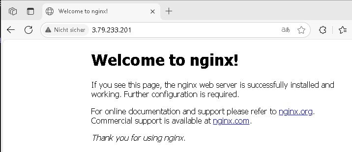

My project deploys an NGINX web server using:

- AWS Elastic Container Registry (ECR)
- AWS Elastic Container Service (ECS Fargate)
- Application Load Balancer (ALB) (optional)
- Docker image: nginx:latest

---

Deployed Using:

- AWS Console UI (IaC version also available)
- Manual Docker push via PowerShell

